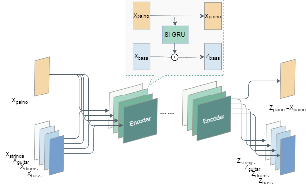

## MuseFlow: Music Accompaniment Generation 

Traditional accompaniment orchestration needs to master the principles of various Musical Instruments and takes a long time. In order to save labor and time costs and reduce the threshold of music creation, this project uses deep learning algorithm to generate musical accompaniment to assist musicians in creating pop music.
This project realized the generation model of pop music accompaniment MuseFlow based on the Flow model, and trained the model with piano roll coding method, which could arrange the accompaniment of drums, guitar, bass and strings for the designated piano theme.

### Recommended

* TensorFlow-gpu ==2.5
* Python ==3.6
* Keras==2.3.1
* midi==0.2.3
* pypianoroll==0.4.6
* music21==6.3.0


## Introduction
- Generative music accompaniment

Directly load the trained model to orchestrate drums, guitar, bass and strings accompaniment for the piano theme. Run generate.py and input the mid format file to obtain the accompaniment result of five tracks.

```
python generate.py --input_mid --output_path
```

- Prepare your own data set and train

The original music dataset includes [Lakh Pianoroll] The Dataset] (https://salu133445.github.io/lakh-pianoroll-dataset/) and [FreeMidi] (https://freemidi.org/genre-pop), millions of MIDI music file, After data processing, it is transmitted to model training in five-track piano roll format. Self-provided data can be used for model training according to the following steps.

  1. Prepare training data

     Data preprocessing Converts the MID file data set into piano volume format using code in the data_processing folder.

     ```
     #Data preprocessing, clearing empty track, melody recognition
     python track_separate.py --input_folder --output_folder --required_tracks
     #data filtering
     python DataFilter.py --dir --outfile
     #Convert to pianoroll
     python converter.py --dir --outfile
     ```

  2. train model

     Npy format file is obtained after data processing, which can train multi-track or single track model and modify config.py file for training parameters.

     ```
     python multi-track.py --input_path
     python single_track.py --input_path --test_path
     ```

  3. Generate the accompaniment

     The trained model arranges drums, guitar, bass and strings accompaniment for the piano theme.

     ```
     python generate.py --input_mid --output_path
     ```

  4. evaluate

     Evaluate the number of notes, pitch intervals, occurrence intervals, and other metrics for a single data set of generated results using sample_evaluate.py. Measure the pitch length distribution difference between two data sets using dataset_evaluate.py.

     ```
     python sample_evaluate.py --input_path
     
     python dataset_evaluate.py --dataset_1 --dataset_2
     ```

  

## Model structure
MuseFlow is a deep learning model for music generation based on Flow model. Five-track piano rolls were input during model training, including piano, drums, guitar, bass and strings. The piano, as a melody track, guided the coding of other tracks. After going through multiple encoders, each dimension of the four accompaniment tracks was mapped to Gaussian space, and the hidden variables and piano theme of the four accompaniment tracks were output. During model generation, gaussian random variables extracted randomly are converted to music through multiple decoders.




